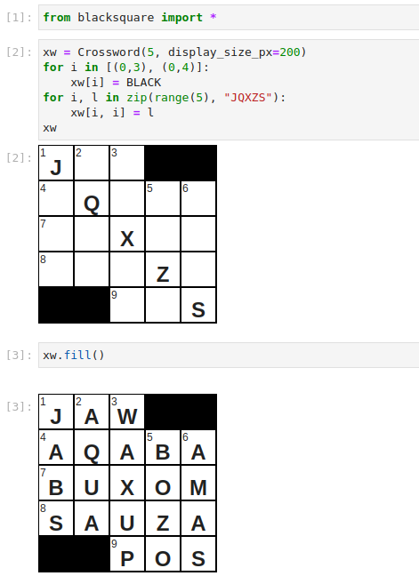

# Export & Publishing

## Across Lite (.puz) Files

`blacksquare` can import and export `.puz` crossword files:

```python
from blacksquare import Crossword

# Load from .puz
xw = Crossword.from_puz("puzzle.puz")

# Save to .puz
xw.to_puz("output.puz")
```

---

## New York Times Submission PDF

You can generate professional submission PDFs following official New York Times guidelines (requires the `[pdf]` optional dependency):

```bash
pip install "blacksquare[pdf]"
```

```python
header_info = [
    "Author: Jane Doe",
    "Address: 123 Main St, New York, NY",
    "Email: jane@example.com",
]

xw.to_pdf("submission.pdf", header=header_info)
```

The resulting PDF contains:
1. A full puzzle grid with clue numbers, circled/shaded styling, and black blocks.
2. Formatted across and down clues.
3. Solution grid page.

---

## Jupyter Notebook HTML

In a Jupyter notebook or Google Colab environment, crosswords render automatically with HTML and CSS:

```python
# In a Jupyter notebook cell:
xw
```


